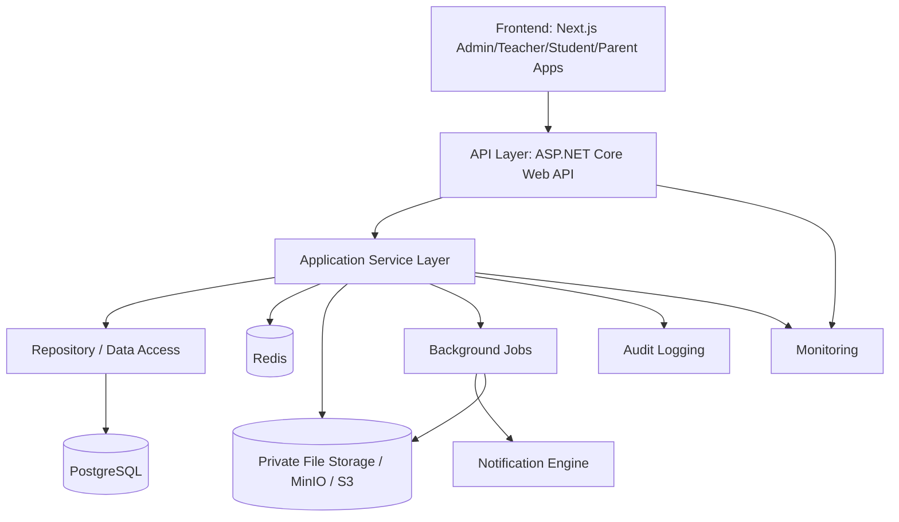

# Phase 1 — Architecture and Design

## 1. Recommended Technology Stack

### Frontend

- Next.js 14+ with TypeScript
- Tailwind CSS
- React Query / TanStack Query
- Zustand or context store
- shadcn/ui or custom design system
- i18next for Arabic/English localization

Why:
- Strong production DX, SSR support, and responsive UI polish.
- Clear separation between server-rendered public pages and authenticated app shell.
- Good fit for role-based dashboards and mobile-first experience.

### Backend

- ASP.NET Core 8 Web API
- Entity Framework Core
- ASP.NET Core Identity or custom auth with roles/claims
- FluentValidation
- MediatR (optional for clean command/query separation)
- Serilog for structured logging

Why:
- Mature RBAC support, strong security defaults, and excellent integration with auditing/authorization.
- Good fit for enterprise-grade API contracts, file authorization, and secure background jobs.
- Easy to enforce server-side permissions and object-level access logic.

### Database

- PostgreSQL 16+

Why:
- Excellent relational model for academic records, schedules, payments, and audit logs.
- Robust indexing, JSON capability for flexible metadata, and mature support for transactions.

### Cache and job infrastructure

- Redis for session/cache/rate-limit support
- RabbitMQ or Azure Service Bus for asynchronous jobs
- MinIO or S3-compatible object storage for private files and videos

Why:
- Supports large video processing, notifications, background reports, and upload workflows without blocking the API.

### Monitoring and observability

- OpenTelemetry
- Prometheus/Grafana or Azure Monitor-style stack
- Application Insights / Sentry for error tracking

### Testing

- xUnit for backend tests
- FluentAssertions
- Testcontainers for Postgres and Redis
- Playwright for high-value end-to-end flows
- API integration tests for auth, RBAC, and workflows

## 2. System Architecture



### Architectural principles

- Clear separation of presentation, API, service, repository, and infrastructure code.
- Dependency injection everywhere where infrastructure services are used.
- Business rules are enforced in services, not in frontend-only controls.
- Event-driven notifications are triggered from domain actions.
- File access and payment decisions are validated by backend logic.
- Sensitive actions are logged to audit tables with before/after values.

## 3. Module and Folder Structure

```text
platform/
├─ apps/
│  ├─ web/
│  │  ├─ app/
│  │  ├─ components/
│  │  ├─ features/
│  │  ├─ locales/
│  │  ├─ styles/
│  │  └─ lib/
│  └─ admin/
│     └─ ...
├─ backend/
│  ├─ src/
│  │  ├─ Api/
│  │  │  ├─ Controllers/
│  │  │  ├─ Middleware/
│  │  │  ├─ Filters/
│  │  │  └─ OpenApi/
│  │  ├─ Application/
│  │  │  ├─ Auth/
│  │  │  ├─ Users/
│  │  │  ├─ Students/
│  │  │  ├─ Teachers/
│  │  │  ├─ Classes/
│  │  │  ├─ Courses/
│  │  │  ├─ Lessons/
│  │  │  ├─ Homework/
│  │  │  ├─ Exams/
│  │  │  ├─ Attendance/
│  │  │  ├─ Grades/
│  │  │  ├─ Payments/
│  │  │  ├─ Subscriptions/
│  │  │  ├─ Notifications/
│  │  │  ├─ Messaging/
│  │  │  ├─ Reporting/
│  │  │  ├─ Audit/
│  │  │  ├─ Files/
│  │  │  └─ Common/
│  │  ├─ Domain/
│  │  │  ├─ Entities/
│  │  │  ├─ Enums/
│  │  │  ├─ ValueObjects/
│  │  │  └─ Events/
│  │  ├─ Infrastructure/
│  │  │  ├─ Persistence/
│  │  │  ├─ Security/
│  │  │  ├─ Storage/
│  │  │  ├─ Jobs/
│  │  │  └─ Integrations/
│  │  ├─ Identity/
│  │  └─ Shared/
│  ├─ tests/
│  │  ├─ Unit/
│  │  ├─ Integration/
│  │  └─ Api/
│  └─ appsettings.*.json
├─ infra/
│  ├─ docker/
│  ├─ k8s/
│  ├─ postgres/
│  └─ backups/
├─ docs/
│  ├─ requirements-analysis.md
│  ├─ phase-1-architecture.md
│  └─ ...
└─ README.md
```

## 4. Database Architecture

### Core design principles

- Use relational tables with foreign keys and proper constraints.
- Keep domains separated by bounded context and modules.
- Use soft delete for most entities to preserve academic and payment history.
- Store sensitive changes in an audit log table with before/after snapshots.
- Use indexes for common lookups: user email, student class, teacher assignment, payment status, subscription expiry, class schedule date ranges.

### Entity groups

#### Identity and access

- Users
- Roles
- Permissions
- UserRoles
- PasswordResetTokens
- RefreshTokens
- LoginAttempts
- TwoFactorSecrets

#### Academic domain

- Students
- Teachers
- Parents
- Centers
- Classrooms
- Classes
- Enrollments
- Subjects
- Courses
- CourseTeachers
- Lessons
- Materials
- Videos
- Homework
- HomeworkQuestions
- HomeworkSubmissions
- Exams
- QuestionBanks
- Questions
- QuestionOptions
- ExamAttempts
- ExamAttemptAnswers
- Attendance
- Grades
- GradeComponents
- AcademicCalendar

#### Payments and subscriptions

- SubscriptionPlans
- Subscriptions
- PaymentRequests
- PaymentProofs
- Payments
- PaymentApprovals

#### Communication and reporting

- Notifications
- NotificationPreferences
- Messages
- MessageParticipants
- Announcements
- Reports
- Exports

#### Security and operations

- AuditLogs
- Files
- FileVersionHistory
- BackgroundJobs
- SystemSettings
- ContentPermissions

### ERD design summary

```text
User 1---* UserRole *---1 Role
User 1---* Student
User 1---* Teacher
User 1---* Parent
Student *---* Class (through Enrollments)
Teacher *---* Class
Teacher *---* Course
Class 1---* Schedule
Class 1---* Attendance
Class 1---* Enrollment
Course 1---* Lesson
Course 1---* Material
Lesson 1---* Video
Homework 1---* HomeworkQuestion
Homework 1---* HomeworkSubmission
Exam 1---* QuestionBank
QuestionBank 1---* Question
Question 1---* QuestionOption
Exam 1---* ExamAttempt
ExamAttempt 1---* ExamAttemptAnswer
Student 1---* Grade
Grade 1---* GradeComponent
Student 1---* Subscription
Subscription 1---* Payment
Payment 1---* PaymentProof
User 1---* AuditLog
User 1---* Notification
User 1---* Message
Class 1---* Announcement
```

### Schema decisions

- Use soft delete on academic and policy-sensitive entities.
- Use enums for status types and lifecycle states.
- Use decimal for money and grade calculations.
- Use immutable audit log records for sensitive changes.
- Keep flexible metadata in JSON only where schema evolution is expected.

## 5. RBAC Model

### Core roles

- SuperAdmin
- Teacher
- Student
- Parent

### Permission model

Permissions are assigned by role and may also be context-scoped by class or course.

Examples:

- manage_students
- manage_teachers
- manage_classes
- manage_courses
- manage_homework
- publish_lessons
- take_attendance
- grade_homework
- grade_exams
- approve_payments
- view_audit_logs
- manage_notifications
- create_announcements
- view_parent_linked_students

### Access control patterns

- Role-based access for broad privileges.
- Resource-based access for class/course enrollment and teacher assignment.
- Policy checks for premium content and subscription access.
- Data ownership validation for student records and submissions.
- Admin-only access for payment approval and sensitive audit data.

### Examples

- Student may only read own grades, attendance, homework submissions, and payment records.
- Teacher may access assigned classes and enrolled students only.
- Parent may access linked students only and may not edit academic records.
- Super Admin may read all audit logs but only authorized roles should trigger them.

## 6. API Architecture

### REST design principles

- Resource-first endpoints grouped by domain.
- Version the API: /api/v1/
- Standard responses: success payload, error envelope, pagination metadata.
- Use HTTP semantics: GET/POST/PATCH/DELETE.
- Validate all input using DTOs and validators.
- Use rate limiting for auth, reset, and payment-sensitive endpoints.
- Document with Swagger/OpenAPI.

### Representative endpoints

#### Auth and identity

- POST /api/v1/auth/register
- POST /api/v1/auth/login
- POST /api/v1/auth/logout
- POST /api/v1/auth/refresh
- POST /api/v1/auth/forgot-password
- POST /api/v1/auth/reset-password
- POST /api/v1/auth/logout-all
- POST /api/v1/auth/verify-email
- POST /api/v1/auth/2fa/enable

#### Users and profiles

- GET /api/v1/users/me
- PATCH /api/v1/users/me
- GET /api/v1/users
- GET /api/v1/users/{id}
- PATCH /api/v1/users/{id}/status
- POST /api/v1/users/{id}/reset-password

#### Students

- GET /api/v1/students
- POST /api/v1/students
- GET /api/v1/students/{id}
- PATCH /api/v1/students/{id}
- PATCH /api/v1/students/{id}/status
- POST /api/v1/students/{id}/classes
- DELETE /api/v1/students/{id}/classes/{classId}
- GET /api/v1/students/{id}/grades
- GET /api/v1/students/{id}/attendance
- GET /api/v1/students/{id}/homework-submissions

#### Teachers

- GET /api/v1/teachers
- POST /api/v1/teachers
- PATCH /api/v1/teachers/{id}
- PATCH /api/v1/teachers/{id}/status
- POST /api/v1/teachers/{id}/classes
- GET /api/v1/teachers/{id}/workload

#### Classes and schedules

- GET /api/v1/classes
- POST /api/v1/classes
- GET /api/v1/classes/{id}
- PATCH /api/v1/classes/{id}
- POST /api/v1/classes/{id}/enrollments
- PATCH /api/v1/classes/{id}/enrollments/{studentId}
- GET /api/v1/classes/{id}/roster
- GET /api/v1/classes/{id}/schedule
- POST /api/v1/classes/{id}/schedule
- PATCH /api/v1/classes/{id}/schedule/{scheduleId}

#### Courses and lessons

- GET /api/v1/courses
- POST /api/v1/courses
- GET /api/v1/courses/{id}
- POST /api/v1/courses/{id}/lessons
- PATCH /api/v1/lessons/{id}
- GET /api/v1/lessons/{id}/content-access

#### Homework and exams

- GET /api/v1/homework
- POST /api/v1/homework
- GET /api/v1/homework/{id}
- POST /api/v1/homework/{id}/submit
- PATCH /api/v1/homework-submissions/{id}/grade
- GET /api/v1/exams
- POST /api/v1/exams
- POST /api/v1/exams/{id}/attempts
- POST /api/v1/exam-attempts/{id}/save-answer
- POST /api/v1/exam-attempts/{id}/submit

#### Payments and subscriptions

- GET /api/v1/payments
- POST /api/v1/payments/requests
- PATCH /api/v1/payments/{id}/review
- GET /api/v1/subscriptions
- PATCH /api/v1/subscriptions/{id}/status

#### Notifications and messaging

- GET /api/v1/notifications
- PATCH /api/v1/notifications/{id}/read
- POST /api/v1/messages
- GET /api/v1/messages/conversations
- GET /api/v1/announcements

#### Reporting and audit

- GET /api/v1/reports/dashboard
- GET /api/v1/reports/students/{id}
- GET /api/v1/reports/classes/{id}
- GET /api/v1/audit-logs
- GET /api/v1/exports/reports

## 7. Frontend Pages and Components

### Super Admin

- Dashboard overview
- Teacher management
- Student management
- Parent management
- Classes and schedules
- Courses and lessons
- Subscriptions and payment review
- Categories and settings
- Audit logs
- Reporting and export

### Teacher

- Teacher dashboard
- Course and class management
- Lesson and material upload
- Homework authoring and grading
- Exam creation and result review
- Attendance capture
- Gradebook
- Student performance analytics
- Announcements and messaging

### Student

- Student dashboard
- My classes and lessons
- Video/library access
- Homework submissions
- Exam attempts and results
- Attendance and grades
- Notifications
- Subscription and payments

### Parent

- Parent dashboard
- Linked student overview
- Attendance and grade summaries
- Homework and exam schedules
- Notifications and announcements
- Payment and subscription status

### Shared components

- login and registration screens
- forgot/reset password flows
- table filters and search
- forms and validation states
- empty/loading/error states
- toasts and confirmation dialogs
- responsive data cards and charts

## 8. Design Patterns to Use

- Factory pattern: question creation by type.
- Strategy pattern: grading engine and notification delivery strategies.
- Observer/event-driven: notifications from homework/exam/payment events.
- Repository pattern: data access separation by aggregate.
- State pattern: lifecycle transitions for payment, homework, and exam states.
- Adapter pattern: external providers like barcode scanners, notification providers, storage integrations.
- Builder pattern: complex exam creation where configuration becomes large.

Only implement these where they add real clarity and maintainability.

## 9. Configurable Business Rules to Preserve

The architecture should include configuration tables for the unsupported or variable decisions:

- class enrollment limits and waitlist rules
- subscription access policy
- grade finalization and override policy
- attendance edit policy
- payment approval policy
- exam retake policy
- language and region settings
- center and classroom configuration
- parent/guardian requirements
- manual payment method definitions

## 10. Unresolved Business Rules and Assumptions

- Student activity across multiple classes is allowed by default but should be configured explicitly.
- Teachers may teach multiple classes by default, subject to schedule conflict checks.
- Subscription expiry should disable premium access while preserving historical records.
- Exams default to honor-system unless proctoring is enabled.
- Parent access is read-only and conditionally available based on student/guardian linkage.
- Manual payment resubmission behavior is configurable.

## 11. Phase Plan

### Phase 1 — Architecture approval

- Confirm stack, default assumptions, and environment model.
- Consolidate all risk areas and business-rule configuration points.

### Phase 2 — Database foundation and core entities

- Create ERD and migrations.
- Validate indexes, constraints, and archival rules.

### Phase 3 — Backend implementation

- Auth and RBAC
- Student/teacher/class/course domain
- Homework/exam/grade logic
- Payment/subscription workflow
- File service and domain events

### Phase 4 — Frontend implementation

- Role-based dashboards
- Student and teacher workflows
- Reporting and mobile experiences

### Phase 5 — Testing and hardening

- Security review, rate limiting, performance, and upload validation.

### Phase 6 — Deployment and operations

- CI/CD, environment setup, backup and restore, monitoring, rollback.

## 12. Recommended Next Step

Before implementation begins, we need approval on the architectural defaults and the key business-rule configuration choices. Once approved, the actual backend/frontend implementation can proceed in the next phase.
